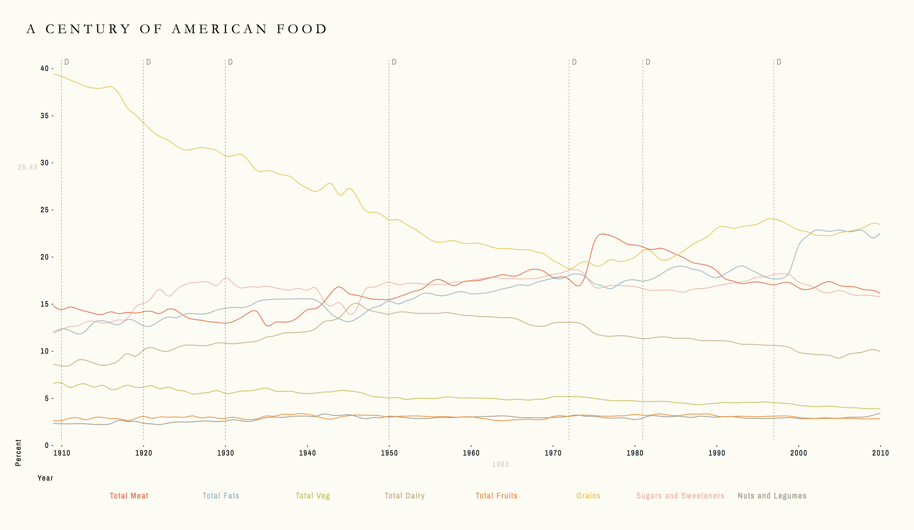
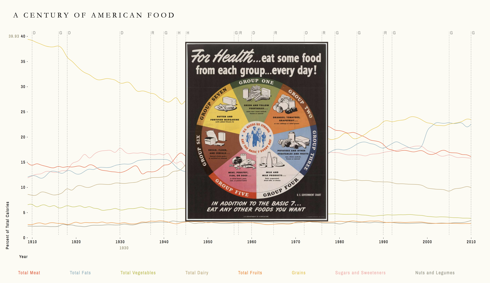
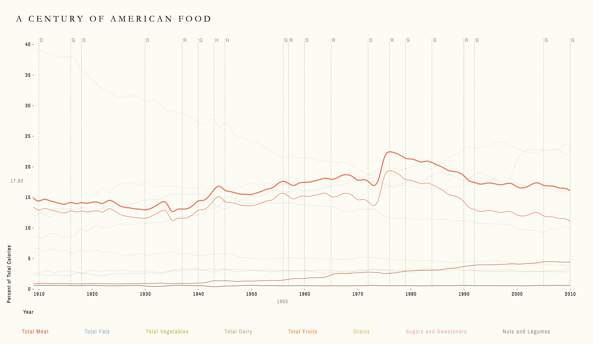
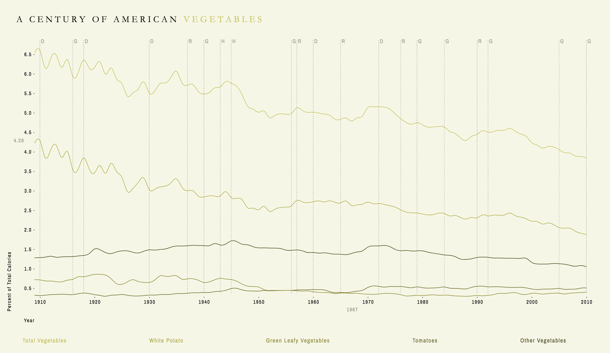
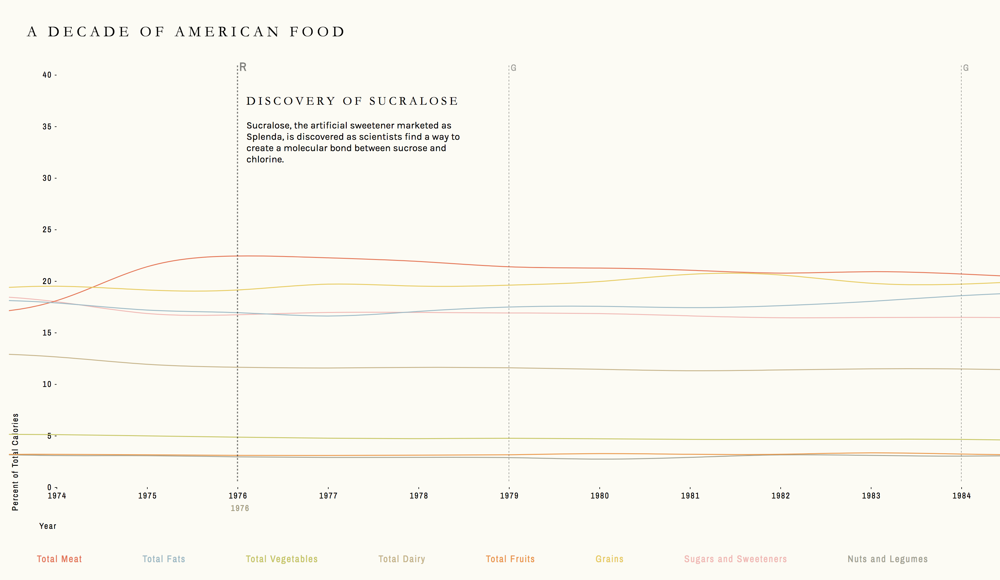

 ## A Century of American Food: An Exploration of Food Discourse and Food Supply in America
 
 ### Preview

 
 
 ### Features

Each colored line displays data for an aggregate food group.  Click on any of the lines or legend labels to view more granular data about the food group.

Each dashed line represents a particular historical event, labeled with letters G for Federal Dietary Guides, D for Diet Trends, R for Research Studies, or H for Economic or Political Events. Hover over any of the letters to see information about the corresponding event, and click on any of the "G" letters to see a picture of the relevant food guide. 

Double click on any point on the chart to zoom to a decade surrounding that point.

 
 
 ### Abstract
 
Americans are thought to be fond of following fad diets, paradigms of eating often based on novel, ever-changing nutrition research. This project is concerned with finding in actuality how American food consumption has changed throughout the past century and illustrating to what extent it responds to relevant historical events. Towards that end, it considers the distribution of foods in the American food supply, which are—to some extent—the foods that Americans desire to eat and—ultimately—the foods that are available for them to eat. 
Tracking this over a span of 100 years, the visualization consists of a timeline exploring this changing distribution, which is then punctuated by qualitative information about significant events in areas like nutrition research, agricultural technology, trend diets, and official dietary guidelines. The project superimposes all of this information to create an honest depiction of the food supply (and, indirectly, food consumption) in America today and in the past. Avoiding reductive statistics and statements, it curates multiple previously uncombined sources of data and portrays them clearly and plainly; in doing so, it invites instructed readers to discover relationships between them. 

### Creators

Rik Ghosh, with help from Daniel Sauter, Aaron Hill, Christian Swinehart, and the Parsons 2018 MSDV cohort.

### More Screenshots

